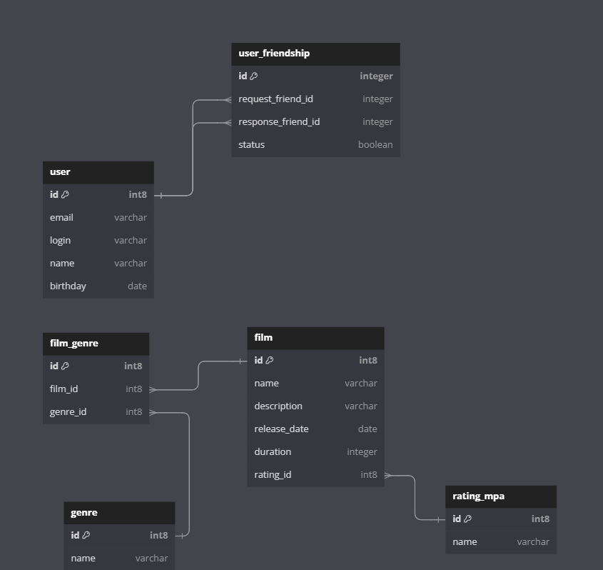

# java-filmorate
Filmorate - бэкенд для сервиса по подбору фильмов на основе рекомендаций пользователей.

В проекте используется база данных PosgreSQL.
Структура базы данных представлена на ER-диаграмме:

Диаграмма включает следующие таблицы:

**user**
Содержит данные пользователя.
- первичный ключ *id* - идентификатор пользователя;
- *email* -почта пользователя;
- *login* - логин пользователя;
- *name* - имя пользователя;
- *birthday* - день рождения пользователя.

**user_friendship**
Содержит информацию о подтверждении дружбы пользователей.
- первичный ключ *id* - идентификатор записи
- внешний ключ *request_friend_id* (ссылается на таблицу **user** поле id) - идентификатор пользователя;
- внешний ключ *response_friend_id* (ссылается на таблицу **user** поле id) - идентификатор пользователя-друга;
- *status* - статус дружбы.
    - неподтверждённая — когда один пользователь отправил запрос на добавление другого пользователя в друзья,
    - подтверждённая — когда второй пользователь согласился на добавление.

**film**
Содержит данные о фильме.
- первичный ключ *id* - идентификатор фильма;
- *name* - название фильма;
- *description* - описание фильма (не более 200 символов);
- *release_date* - дата релиза фильма;
- *duration* - продолжительность фильма;
- внешний ключ *rating_id* (ссылается на таблицу **rating_mpa** поле id) - идентификатор возрастного рейтинга.

**film_genre**
Содержит данные о жанрах, к которым относится фильм.
- первичный ключ *id* - идентификатор записи;
- внешний ключ *film_id* (ссылается на таблицу **film** поле id) - идентификатор фильма;
- внешний ключ *genre_id* (ссылается на таблицу **genre** поле id) - идентификатор жанра.

**genre**
Содержит название жанров.
- первичный ключ *id* - идентификатор жанра;
- *name* - название жанра, например:
    - *Comedy* - комедия,
    - *Drama* - драма,
    - *Cartoon* - мультфильм,
    - *Thriller* - триллер,
    - *Documentary* - документальный,
    - *Action* - боевик.

**rating_mpa**
Содержит названия оценок, указывающих на возрастные ограничения, согласно рейтингу Ассоциации кинокомпаний.
- первичный ключ *id* - идентификатор рейтинга;
- *name* - название оценки, например:
    - *G* - у фильма нет возрастных ограничений,
    - *PG* - детям рекомендуется смотреть фильм с родителями,
    - *PG-13* - детям до 13 лет просмотр не желателен,
    - *R* - лицам до 17 лет просматривать фильм можно только в присутствии взрослого,
    - *NC-17* - лицам до 18 лет просмотр запрещён.